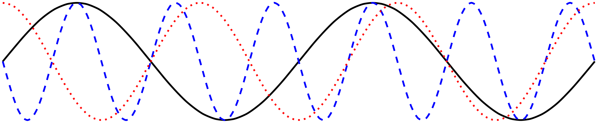
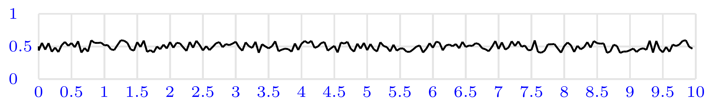

---
jupytext:
  formats: md:myst
  text_representation:
    extension: .md
    format_name: myst
    format_version: 0.13
    jupytext_version: 1.11.5
kernelspec:
  display_name: Python 3
  language: python
  name: python3
---

# <font color='navy'> Užitočné makrá  </font>


%========================================================================
% SINUSOID
%-------------------------------------------------------------------------

```{code-cell} ipython3 
:tags: ["remove-cell"]

from src.utils import *

data = r'''
include(lib_base.ckt)
include(lib_color.ckt)

Origin: Here 

move to (0,1); 
ampl = 1;  freq = 2;  t_min = 0;  t_max = 10;  phase = -pi_/2;
sinusoid(ampl, twopi_*freq/t_max, phase, t_min , t_max);

move to (0,1); 
color_blue;
ampl = 1;  freq = 6;  t_min = 0;  t_max = 10;  phase = pi_/2;
sinusoid(ampl, twopi_*freq/t_max, phase, t_min , t_max, dashed);

move to (0,1); 
color_red;
ampl = 1;  freq = 3;  t_min = 0;  t_max = 10;  phase = 0;
sinusoid(ampl, twopi_*freq/t_max, phase, t_min , t_max, dotted);
'''

_ = cm_compile('cm_0210a', data,  dpi=600 )   
```

%-------------------------------------------------------------------------

````{tab-set}

```{tab-item} sinusoid()

```

```{tab-item} Popis
    Zobrazenie harmonického priebehu
    
    sinusoid(ampl, freq, phase, t_min, t_max)
    
      ampl  - amplitúda
      freq  - frekvencia
      phase - fáza
      t_min - začiatok časovej osi
      t_max - koniec časovej osi
```


```{tab-item} Príklad
    Origin: Here;
    sinusoid(1.0, twopi_*2/10,-pi_/2, 0, 10) at Origin;
    sinusoid(1.0, twopi_*6/10, pi_/2, 0, 10, dashed) at Origin;
    sinusoid(0.5, twopi_*3/10,     0, 0, 10, dotted) at Origin;
```

````

%========================================================================
% RAND, RANDN
%-------------------------------------------------------------------------

```{code-cell} ipython3 
:tags: ["remove-cell"]
from src.utils import *

data = r'''
#include(lib_base.ckt)
#include(lib_color.ckt)

Origin: Here 
#Grid(10, 1);

move to (0,0.5);
for x = 0 to 10  by 0.05 do { line to (x, rand()*0.25); } 
'''

_ = cm_compile('cm_0210b', data,  dpi=600)   
```

%-------------------------------------------------------------------------


````{tab-set}

```{tab-item} rand(), randn()

```

```{tab-item} Popis    
    rand(), randn()
```


```{tab-item} Príklad
    for x = 0 to 10  by 0.05 do { line to (x, rand()*0.25); } 
    
    stddev = 0.25
    n=100
    randn(z,n,0,stddev) 
    m = 0
    for i=1 to n-1 by 2 do { m +=1; x[m] = z[i]; y[m] = z[i+1]
        dot(at (x[m],y[m]))
    }
```

````

%========================================================================


    shadebox(box attributes, shade width)
    
    
```{code-cell} ipython3 
:tags: ["remove-cell"]
from src.utils import *

data = r'''

include(lib_base.ckt)
include(lib_color.ckt)

Origin: Here 
Grid(5, 3);

move to (0,0);
shadebox(B:box wid 3 ht 1 with .sw at (1,1), 2) 
"text" at B.c;
'''

_ = cm_compile('cm_0210c', data, dpi=600)   
```


```{figure} ./src/cm_0210c.png
:width: 300px
:name: cm_037

Makro shadebox()
```


    hatchbox()

    

```{code-cell} ipython3 
:tags: ["remove-cell"]
from src.utils import *

data = r'''
include(lib_base.ckt)

Origin: Here 
Grid(5, 3);

move to (1,1.5);
linethick_(0.8);
hatchbox(wid 3 ht 2, ,dashed,angle=125 ); 
'''

_ = cm_compile('cm_0210d', data,  dpi=600)   
```


```{figure} ./src/cm_0210d.png
:width: 300px
:name: cm_038

Makro hatchbox()
```


